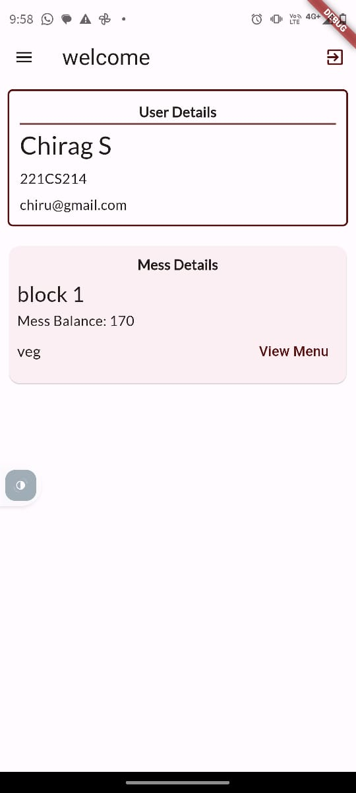
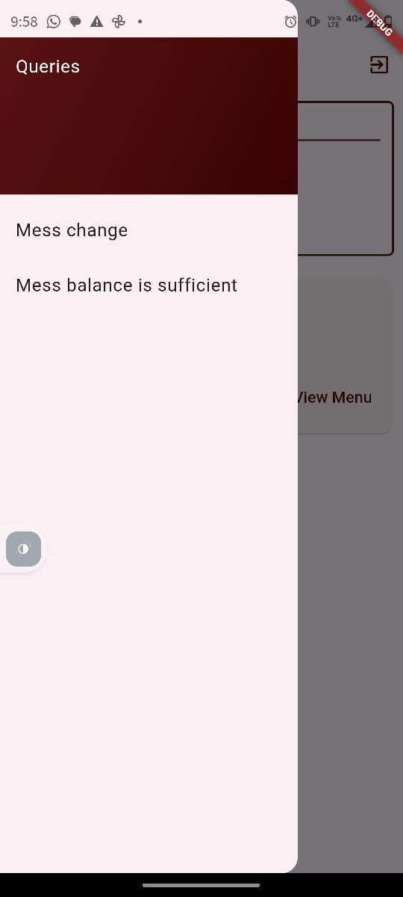
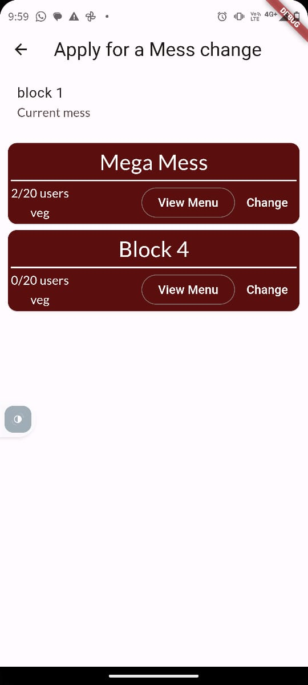
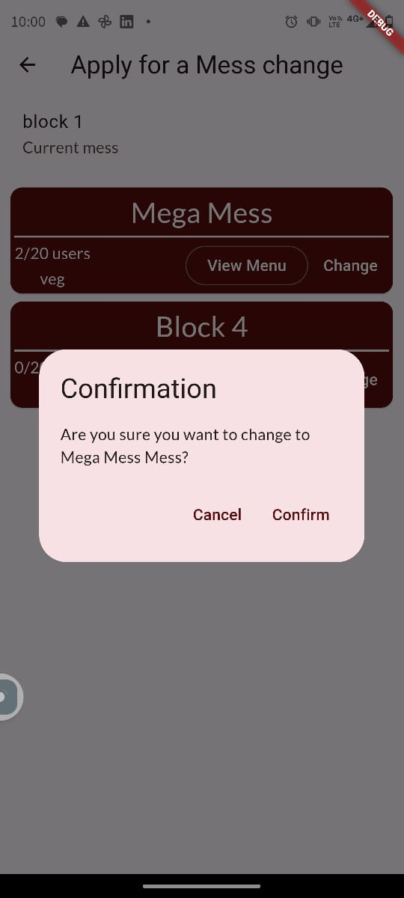
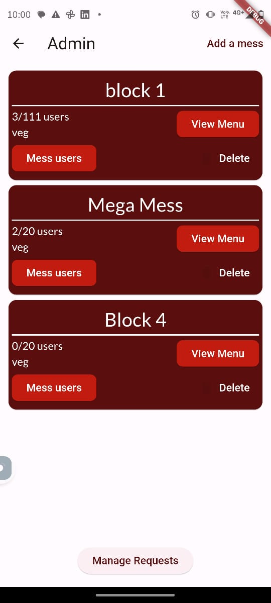
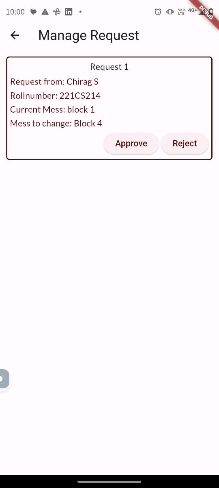
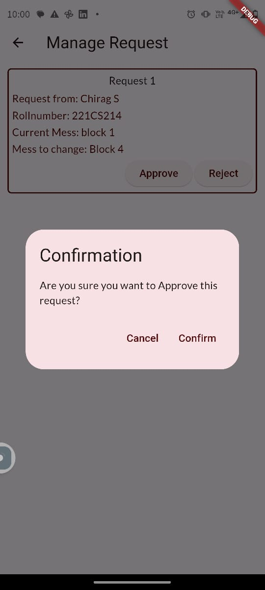

# MessManager

My flutter project for the IRIS app team recruitment.

## Application Details

  About the application 

  This app helps students register for their college food mess and grants them additional features like viewing menus and food options, requesting a mess change, and managing their mess finances. It makes the whole process simple, straightforward, and easy to use. With MessManager, managing your college food mess is simple, convenient, and stress-free

  

    List of features implemented:
  

   
 Role based login:
    
 Both the user and admin can open their corresponnding section the app using the same page. 
   
  
    
  ##  User: 
  
 ### 1. User Registration:
 
  The user must sign up for the mess for the first time through the signup : 
  Once the sign up is done, user has to register for the mess, 
  which includes chosing the mess, selecting the data and the corresponding mess balance.
     
     
     ->  ->  ->  -> 
  Finally after registering the User detail along with the mess detail will be shown.
  

  
### 2. Mess balance top up:  
  Once the mess balance is less than the per day cost of the mess, the user can increase the mess balance
  - Select the side drawer in the user screen
  - If mess balance is less then per day cost, then "Add mess balance" will be enabled
  - Enter the amount to be added
  - Confirm the additon of the balance
 
 ->  ->  -> 
 

## Admin
Admin has several access in the app. 
### 1. Adding a new mess and delete the mess:
 
Admin can set the parameters such as the 
- Mess type
- Per day cost of the mess
- Total occupants in the mess
- The mess menu
    here is the flow of through the screen shots:
    
   ->  ->  -> 
    Similarly the mess can be deleted.
    
### 2. User Deallocation from any mess:  
 Mess admin can view the users of each mess and can individually deallocate each user from the mess 
The procedure is simple
- select the messuser button in the mess screen,
- all users will be shown
- press deallocate, and then confirm it
- the user will be deallocated from that mess
 
 ->  ->  -> 
  Thus the user will be deallocated

## Mess Change
This app has the feature, wherein 
- the user can apply for a mess change
- the request is sent to the user
- The admin has to either accept or reject the request
- If accepted the mess of the user will be changed
  Following are the screenshots to show the flow:
 
### Sending request from the user side: 
  
 ->  ->  ->   
  
### Managing request from the user side:
 
 ->  ->   
In this way the corresponding mess changes can be handled by the admins.

    

     Apk file for the app:  
    

     Note: To access the admin screen just type admin in the username and press enter
      
    <a href="https://drive.google.com/drive/folders/1sYOsiO0OoUzm4vHy0a9gEdSFQKVSlUDo?usp=drive_link.">Link to APK</a>
   
    Video for the app:  
   <a href="https://drive.google.com/drive/folders/1IJbD00SqSI2sdXhzFMYlFCyh0oqezDGJ?usp=sharing">Link to Vedio</a>
  

  

    

      List of references:  
    

     <a href="https://youtu.be/THCkkQ-V1-8?si=BfN39e9PYNFCsxRj">Flutterly</a>
     
    <a href="https://www.udemy.com/">Udemy course</a>
  

    
  

  

    List of non-implemented features:
  

     - Proper statemanagement technique
      
     - Dynamic deduction of mess balance using firebase functions
      
     - Notifications to both user and admin using Firebase cloud messaging
      
     - A very UI
  

 

   

     List of design tools used
   

   - Figma
 

